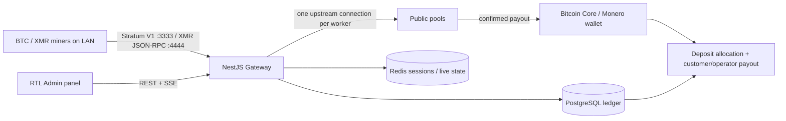

# Mining Gateway — Bitcoin & Monero

[فارسی](#راه‌اندازی-سریع) · [English](#quick-start-english)

این مخزن یک gateway چندمستاجری برای عبور امن ترافیک ماینرهای LAN به استخرهای عمومی است. پروژه **استخر مستقل تولید block نیست**. هر worker یک اتصال مستقل upstream دارد، share پیش از ارسال در PostgreSQL ثبت می‌شود و تسویه فقط از deposit واقعاً دریافت‌شده در wallet انجام می‌گیرد.



## راه‌اندازی سریع

پیش‌نیازها: Node.js 24 LTS، pnpm 10، Docker Engine/Compose و حداقل 16 GiB RAM. برای Monero pruned حداقل حدود 100 GiB و برای کل استقرار 250 GiB فضای SSD آزاد در نظر بگیرید.

Windows PowerShell:

```powershell
.\scripts\setup.ps1 -StartCore
$env:BOOTSTRAP_ADMIN_EMAIL='owner@example.com'
$env:BOOTSTRAP_ADMIN_PASSWORD='use-a-long-unique-password'
pnpm bootstrap:admin
pnpm dev
```

Ubuntu:

```bash
sh scripts/setup.sh
docker compose --env-file .env.infrastructure --profile core up -d
pnpm db:deploy
BOOTSTRAP_ADMIN_EMAIL=owner@example.com BOOTSTRAP_ADMIN_PASSWORD='use-a-long-unique-password' pnpm bootstrap:admin
pnpm dev
```

پنل توسعه روی `http://127.0.0.1:5173` و API روی `http://127.0.0.1:3000` است. برای production:

```bash
pnpm build
NODE_ENV=production SERVE_ADMIN_STATIC=true pnpm start:prod
```

NestJS عمداً داخل Compose نیست. profileها:

```bash
docker compose --env-file .env.infrastructure --profile core up -d
docker compose --env-file .env.infrastructure --profile bitcoin up -d
docker compose --env-file .env.infrastructure --profile monero up -d
docker compose --env-file .env.infrastructure --profile observability up -d
docker compose --env-file .env.infrastructure --profile core --profile backup up -d
```

پیش از اتصال ماینر:

1. در پنل یک upstream بسازید و اتصال آن را Test کنید.
2. آدرس receive اختصاصی همان upstream را در حساب استخر عمومی به‌عنوان payout address ثبت کنید.
3. customer و worker بسازید و token یک‌بارنمایش را همان لحظه ذخیره کنید.
4. برای customer یک portal access code یک‌بارنمایش بسازید و جدا از token ماینر تحویل دهید.
5. ماینر BTC را به `stratum+tcp://SERVER_LAN_IP:3333` یا XMRig را به `SERVER_LAN_IP:4444` وصل کنید؛ username برابر `customer.worker` و password همان token است.
6. مشتری در `/portal` hashrate، درآمد تخصیص‌یافته، تخمین، موجودی، موعد بعدی واریز و تاریخچه را می‌بیند و مقصد payout را ثبت می‌کند؛ مقصد پس از cooling امنیتی 24 ساعت فعال می‌شود.

زمان‌بندی تسویه از Settings پویاست: `INTERVAL=240` برای هر ۴ ساعت و `INTERVAL=360` برای هر ۶ ساعت. رسیدن زمان scheduler تضمین پرداخت نیست؛ فقط موجودی واقعاً دریافت‌شده و تأییدشده‌ای که حداقل‌ها و کنترل‌های policy را پاس کند وارد batch می‌شود.

`ENABLE_MAINNET_PAYOUTS=false` پیش‌فرض سخت پروژه است. تا پایان [چک‌لیست mainnet](docs/MAINNET_CHECKLIST.fa.md) آن را تغییر ندهید.

### آدرس production و TLS

برای ماینرهای خارج از VLAN، ورودی plaintext را خاموش و TLS را فعال کنید:

```dotenv
BITCOIN_GATEWAY_TCP_ENABLED=false
BITCOIN_GATEWAY_TLS_ENABLED=true
BITCOIN_GATEWAY_TLS_HOST=0.0.0.0
BITCOIN_GATEWAY_TLS_PORT=443
BITCOIN_GATEWAY_TLS_CERT_FILE=../../secrets/stratum-tls-cert.pem
BITCOIN_GATEWAY_TLS_KEY_FILE=../../secrets/stratum-tls-key.pem
```

در این حالت URL مشتری `stratum+ssl://MINING_DOMAIN:443` است. بعضی firmwareها همان URL را با عنوان `stratum+tcp` و یک گزینه جداگانه SSL/TLS نمایش می‌دهند؛ رفتار دستگاه را با handshake واقعی بررسی کنید. Caddy پنل مدیریت به‌طور پیش‌فرض روی host port `8443` قرار دارد تا با Stratum TLS روی `443` تداخل نکند.

در deployment واقعی، Caddy را با `compose.production.yaml` بالا بیاورید تا به‌جای CA داخلی توسعه از همان certificate معتبر دامنه استفاده کند. چون پورت عمومی 443 در اختیار Stratum است، اتکا به HTTP/TLS-ALPN challenge خودکار Caddy برای پنل 8443 درست نیست؛ certificate باید بیرون از سرویس صادر/تمدید و در مسیرهای `secrets/stratum-tls-*.pem` جایگزین شود.

هر endpoint جایگزین یک حساب عمومی pool باید `accountKey` یکسان، receive address یکسان و credential یکسان داشته باشد. `accountKey` باعث می‌شود shareهای همه endpointهای failover با یک deposit مشترک تسویه شوند.

## اسناد

- [معماری](docs/ARCHITECTURE.md)
- [مدل تهدید و امنیت](docs/THREAT_MODEL.md)
- [افزودن استخر](docs/POOL_ONBOARDING.fa.md)
- [استقرار Windows و Ubuntu](docs/DEPLOYMENT.fa.md)
- [راهنمای کامل Production](docs/PRODUCTION_RUNBOOK.fa.md)
- [استقرار Production با Nginx](docs/PRODUCTION_NGINX.fa.md)
- [فعال‌سازی Monero بعداً](docs/ENABLE_MONERO_LATER.fa.md)
- [عملیات روزانه](docs/OPERATIONS.fa.md)
- [Backup و Restore](docs/BACKUP_RESTORE.fa.md)
- [عیب‌یابی](docs/TROUBLESHOOTING.fa.md)
- [گزارش نهایی و مفاهیم](FINAL_REPORT.fa.md)

## آزمون و کنترل کیفیت

```bash
pnpm lint
pnpm typecheck
pnpm test
pnpm test:e2e:local-mining
pnpm test:e2e:local-mining:bitcoin-cpu
pnpm test:e2e:local-mining:bitcoin-public
pnpm test:e2e:local-mining:xmrig
pnpm build
docker compose --profile core --profile bitcoin --profile monero --profile observability --profile backup config --quiet
./scripts/preflight-production.ps1 -BaseUrl https://gateway.local:8443 -StratumHost mine.example.com
```

`bitcoin-cpu` یک job کم‌سختی را با SHA-256d واقعی روی CPU حل می‌کند و پذیرش مستقل upstream و ثبت PostgreSQL را می‌سنجد. `bitcoin-public` علاوه بر آن به CKPool عمومی وصل می‌شود، احراز هویت و دریافت job واقعی mainnet را بررسی می‌کند و برای جلوگیری از هر اثر مالی، هیچ share عمومی ارسال نمی‌کند.

بخش live در preflight فقط handshake TLS را نمی‌سنجد: status هر دو wallet، receive address هر حساب pool و handshake واقعی `subscribe/authorize` یا `login` تمام endpointهای فعال نیز باید موفق باشند. این self-test تراکنش یا payout ایجاد نمی‌کند.

برای load test فایل نمونه‌ی `apps/server/test/load/credentials.example.json` را با workerهای واقعی پر کنید:

```powershell
$env:LOAD_CREDENTIALS_FILE='apps/server/test/load/credentials.json'
$env:LOAD_CONNECTIONS='100'
$env:LOAD_HOLD_MS='1800000'
pnpm test:load
```

برای burst مقدار `LOAD_CONNECTIONS=500` را بگذارید. این تست به upstream واقعی/fake سالم و workerهایی با سقف اتصال کافی نیاز دارد.

## Quick start (English)

This is a multi-tenant LAN mining gateway, not a block-producing pool. Run `scripts/setup.sh` (or `scripts/setup.ps1` on Windows), start the `core` Compose profile, deploy migrations, bootstrap the Owner, then run `pnpm dev`. Keep mainnet payouts disabled until the checklist is complete. The admin UI defaults to Persian RTL and can be switched to English.

## Safety and legal notice

Hot wallets must only hold the operational payout float. Pool terms, custody, tax, sanctions/geographic restrictions and local money-transmission rules are the operator’s responsibility. No software checklist replaces an independent legal and security review.
